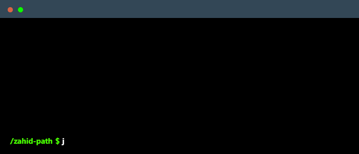

 

<!--
    Your own Terminal GIF can be created here -> https://www.terminalgif.com
-->
---

    

### Skills:

#### Primary Skill: 

#### Others: 

#### Operating System:

#### Studying:

### Publications

  
  

 

### Connect with me!

    
    
    
    

<!--
     Oh, hello there, recruiters!
-->

<!--
     Thanks for being my guest <3
-->
